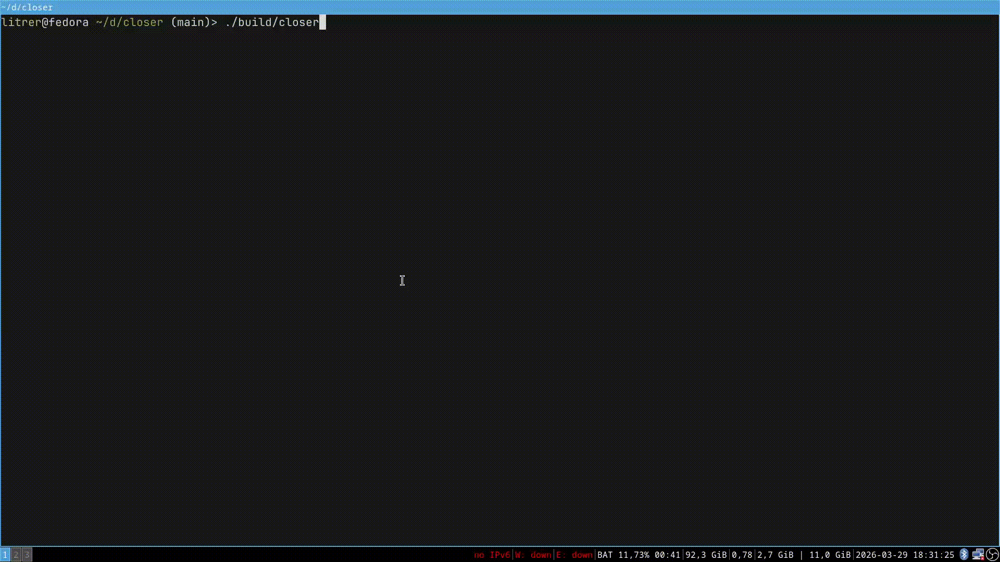

# Closer

A simple X11 client application which calls systemctl to Close your mashine. Does not use Xlib or XCB. Fully statically linked.



# But why tho?

As the year of linux desktop creeps ever Closer i was eager to explore X11 protocol in depth. There is no gui shutdown app on my linux distro and the idea was born. It probably makes no sense for you to install. But at least it's a decent example in how to implement X11 clients without Xlib or XCB.

# Building

I rely on certain compiler extensions, more specifically inline assembly and packed structs. The build should work for a decently new gcc or clang. To build
from within the project root run <em>build.sh</em> script.

```bash
./buils.sh
```

If you append <em>clang</em> to the command the script will use clang instead of gcc. You can also append <em>release</em> to get optimized code. Also the buttons do nothing in debug mode, you just quit.

To build the release version with clang run:

```bash
./build.sh release clang
```

The order of arguments does not matter. Don't forget to add executable permissions to the script!

# References
- The X11 protocol spec: [https://x.org/releases/X11R7.7/doc/xproto/x11protocol.html](https://x.org/releases/X11R7.7/doc/xproto/x11protocol.html)
- Valigo's video that was an inspiration for this project: [https://www.youtube.com/watch?v=-d6ASlj56P4](https://www.youtube.com/watch?v=-d6ASlj56P4)
- An example of X11 client without Xlib or XCB that I was sometimes referencing: [https://gist.github.com/CaitCatDev/93a53cd8b452d6c6bfe9bbb2c7e8b606](https://gist.github.com/CaitCatDev/93a53cd8b452d6c6bfe9bbb2c7e8b606)
